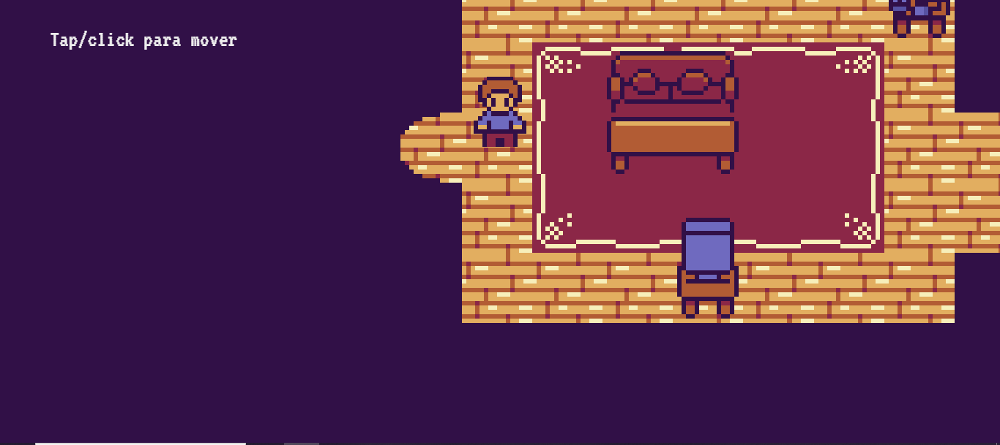
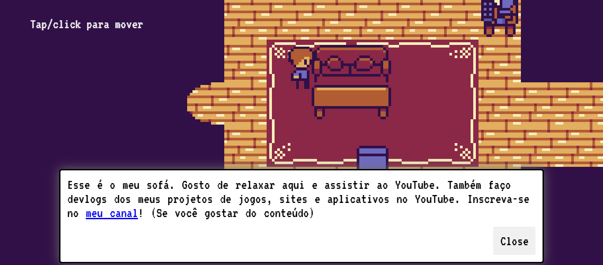

# 💼 Meu Github
> Uma apresentação sobre mim através de pequeno jogo interativo.

---

## 🚀 Demonstração
🔗 **Acesse o projeto:** [link-do-deploy-aqui](http://meu-github-gamma.vercel.app/)  

📸 **Preview:**  


---

## 📚 Sumário
- [Sobre o Projeto](#-sobre-o-projeto)
- [Tecnologias](#️-tecnologias)
- [Funcionalidades](#-funcionalidades)
- [Como Rodar o Projeto](#-como-rodar-o-projeto)
- [Como Usar](#-como-usar)
- [Screenshots](#️-screenshots)
- [Aprendizados](#-aprendizados)
- [Estrutura de Pastas](#-estrutura-de-pastas)
- [Roadmap](#-roadmap)
- [Links Úteis](#-links-úteis)
- [Autor](#-autor)
- [Licença](#-licença)

---

## 💡 Sobre o Projeto
Este Jogo foi desenvolvido **para me apresentar,de uma forma divertida**.  
O jogo foi construído com **html, css, javascript**, com a biblioteca `Kaboom.js`.

---

## 🛠️ Tecnologias
As principais tecnologias utilizadas neste projeto foram:

- **HTML**
- **CSS**
- **Javascript**
- **Kaboom.js**(criador de jogos na web)

<div align="right">
  
  
  
  
  
</div>

---

## 📚 Funcionalidades
- [x] Andar pelo clique do mouse
- [x] Interações com os objetos
- [x] Dialógos do personagens
- [x] Links de perfil

---

## 📦 Como Rodar o Projeto
Siga as etapas abaixo para executar o projeto localmente:

```bash
# Clone este repositório
git clone https://github.com/joao-enrique/meu-github.git

# Installe as depedências
npm install
# Rode o Código
npm run dev
```
E abra o projeto no seu navegador.
> 💡 Caso não tenha o node.js instalado, procure no google e siga os passos para sua instalação.

---

## 🧪 Como Usar
1. Instale as depedências com o `node.js`.
2. Abra o site no navegador.
3. Jogue o jogo.

---

## 🖼️ Screenshots
### 💻 tela inicial

### 💻 tela de texto


---

## 🧠 Aprendizados
Durante o desenvolvimento deste projeto, aprimorei:
- Meus conhecimentos no `Kaboom.js`;
- Criação de um jogo no navegador;
- Aprimoração na linguagem `Javascript` para criação de jogos.

---

## 📁 Estrutura de Pastas
meu-github/ </br>
├── public/ </br>
├── src/ </br>
└── README.md </br>
---

## 🚧 Roadmap
- [] Atualiza-lo com informações (Quando precisar)

---

## 🔗 Links Úteis
🌐 Deploy: [link](https://meu-portfolio-lemon-sigma.vercel.app/)  </br>
💼 LinkedIn: [link](https://www.linkedin.com/in/joao-enrique-dev/) </br>
🧠 GitHub: [link](https://github.com/joao-enrique) </br>
🎮 Itch-io: [link](https://jedev1.itch.io/) </br>
📹 YouTube: [link](https://www.youtube.com/@joaocodedev) </br>
✨ Linktree: [link](https://linktree-eight-gules.vercel.app/) </br>

## 👨‍💻 Autor
Feito com 💜 por [João Enrique](https://linktree-eight-gules.vercel.app/)
<div align="right">
  <a href="https://www.linkedin.com/in/joao-enrique-dev/" target="_blank">
    
  </a>
  <a href="https://www.youtube.com/@joaocodedev" target="_blank">
    
  </a>
  <a href="https://jedev1.itch.io/" target="_blank">
    
  </a>
</div>

---

## 📜 Licença
Este projeto está sob a licença **MIT** — veja o arquivo [LICENCE](./LICENSE) para mais detalhes.


### ⭐ Se este projeto te inspirou, não esqueça de deixar uma **estrela** no repositório!